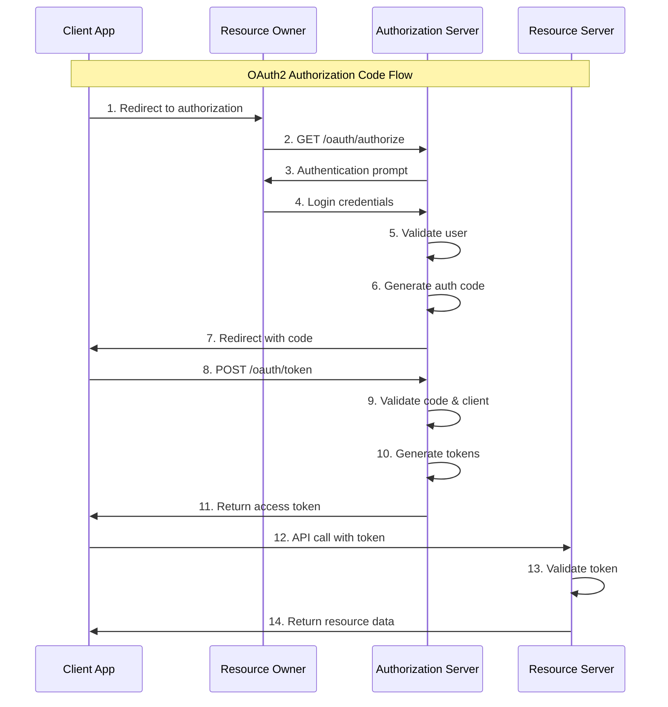
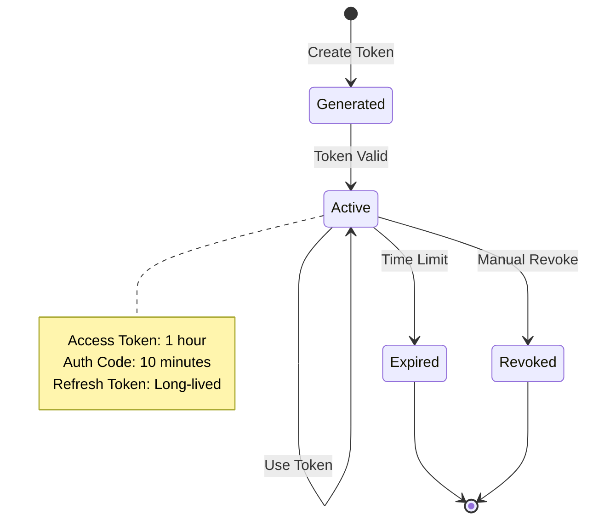
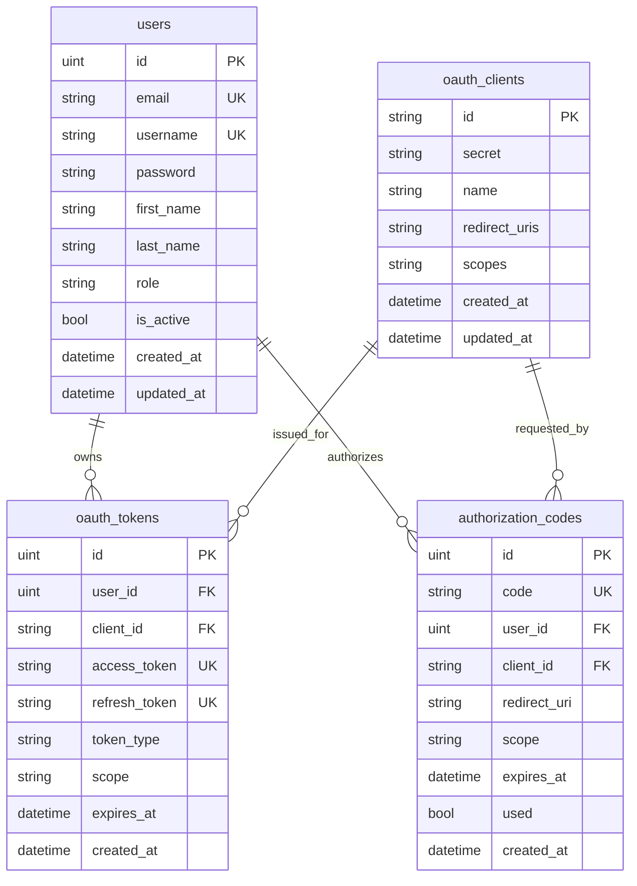
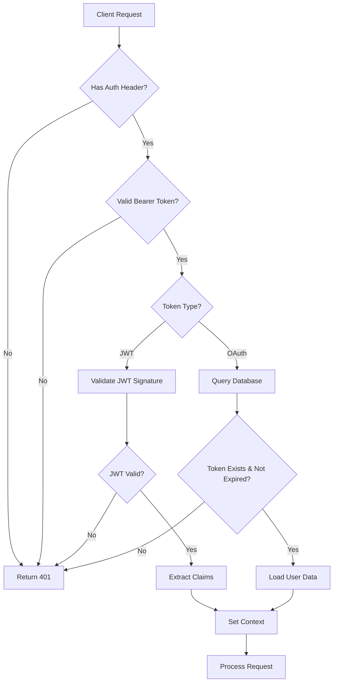

# 🏗️ OAuth2 Architecture Documentation

Complete technical architecture and implementation details for the OAuth2 Authorization Server

## 📐 System Architecture

### High-Level Architecture

```
┌─────────────────────────────────────────────────────────────────┐
│                        OAuth2 Authorization Server             │
├─────────────────────────────────────────────────────────────────┤
│                                                                 │
│  ┌─────────────┐    ┌─────────────┐    ┌─────────────┐         │
│  │    Gin      │    │    GORM     │    │   bcrypt    │         │
│  │ Web Server  │    │     ORM     │    │  Password   │         │
│  │             │    │             │    │   Hashing   │         │
│  └─────────────┘    └─────────────┘    └─────────────┘         │
│                                                                 │
│  ┌─────────────┐    ┌─────────────┐    ┌─────────────┐         │
│  │    JWT      │    │   SQLite    │    │   UUID      │         │
│  │   Tokens    │    │  Database   │    │ Generator   │         │
│  │             │    │             │    │             │         │
│  └─────────────┘    └─────────────┘    └─────────────┘         │
│                                                                 │
├─────────────────────────────────────────────────────────────────┤
│                        Application Layers                      │
├─────────────────────────────────────────────────────────────────┤
│                                                                 │
│  ┌─────────────────────────────────────────────────────────┐   │
│  │                    Handlers Layer                       │   │
│  │  ┌─────────────┐  ┌─────────────┐  ┌─────────────┐    │   │
│  │  │    Auth     │  │    User     │  │   OAuth2    │    │   │
│  │  │  Handlers   │  │  Handlers   │  │  Handlers   │    │   │
│  │  └─────────────┘  └─────────────┘  └─────────────┘    │   │
│  └─────────────────────────────────────────────────────────┘   │
│                                                                 │
│  ┌─────────────────────────────────────────────────────────┐   │
│  │                   Services Layer                        │   │
│  │  ┌─────────────┐  ┌─────────────┐  ┌─────────────┐    │   │
│  │  │    User     │  │   OAuth2    │  │  Security   │    │   │
│  │  │   Service   │  │   Service   │  │   Service   │    │   │
│  │  └─────────────┘  └─────────────┘  └─────────────┘    │   │
│  └─────────────────────────────────────────────────────────┘   │
│                                                                 │
│  ┌─────────────────────────────────────────────────────────┐   │
│  │                   Data Layer                            │   │
│  │  ┌─────────────┐  ┌─────────────┐  ┌─────────────┐    │   │
│  │  │    User     │  │   OAuth     │  │    Token    │    │   │
│  │  │   Models    │  │   Models    │  │   Models    │    │   │
│  │  └─────────────┘  └─────────────┘  └─────────────┘    │   │
│  └─────────────────────────────────────────────────────────┘   │
│                                                                 │
└─────────────────────────────────────────────────────────────────┘
```

### Request Flow Architecture

```
Client Request
     │
     ▼
┌─────────────┐
│    Gin      │ ◄── HTTP Router & Middleware
│   Router    │
└─────────────┘
     │
     ▼
┌─────────────┐
│    CORS     │ ◄── Cross-Origin Resource Sharing
│ Middleware  │
└─────────────┘
     │
     ▼
┌─────────────┐
│    Auth     │ ◄── JWT Token Validation
│ Middleware  │
└─────────────┘
     │
     ▼
┌─────────────┐
│  Handlers   │ ◄── Request Processing
│             │
└─────────────┘
     │
     ▼
┌─────────────┐
│  Services   │ ◄── Business Logic
│             │
└─────────────┘
     │
     ▼
┌─────────────┐
│  Database   │ ◄── Data Persistence
│   (GORM)    │
└─────────────┘
```

## 🔄 OAuth2 Flow Implementation

### Authorization Code Flow Sequence



### Token Lifecycle



## 🏛️ Component Architecture

### Handler Layer

```go
type AuthHandler struct {
    userService  *UserService
    oauthService *OAuthService
}

// Responsibilities:
// - HTTP request/response handling
// - Input validation
// - Response formatting
// - Error handling
```

**Key Methods:**
- `Register()` - User registration endpoint
- `Login()` - User authentication endpoint
- `Authorize()` - OAuth2 authorization endpoint
- `Token()` - OAuth2 token exchange endpoint
- `UserInfo()` - OAuth2 user information endpoint

### Service Layer

```go
type UserService struct {
    db *gorm.DB
}

type OAuthService struct {
    db        *gorm.DB
    jwtSecret string
}

// Responsibilities:
// - Business logic implementation
// - Data validation
// - Security operations
// - Token management
```

**UserService Methods:**
- `CreateUser()` - User creation with password hashing
- `ValidateUser()` - Credential validation
- `GetUserByID()` - User retrieval
- `UpdateUser()` - Profile updates

**OAuthService Methods:**
- `GenerateAuthorizationCode()` - Auth code creation
- `ValidateAuthorizationCode()` - Auth code validation
- `CreateOAuthToken()` - Token generation
- `ValidateAccessToken()` - Token validation

### Model Layer

```go
// Domain models with GORM annotations
type User struct {
    ID        uint
    Email     string
    Username  string
    Password  string
    Role      string
    // ... other fields
}

type OAuthClient struct {
    ID           string
    Secret       string
    RedirectURIs string
    Scopes       string
    // ... other fields
}

type OAuthToken struct {
    AccessToken  string
    RefreshToken string
    UserID       uint
    ClientID     string
    ExpiresAt    time.Time
    // ... other fields
}
```

## 🔧 Configuration Management

### Environment-based Configuration

```go
type Config struct {
    Port        string
    DatabaseURL string
    JWTSecret   string
}

func Load() *Config {
    return &Config{
        Port:        getEnv("PORT", "8080"),
        DatabaseURL: getEnv("DATABASE_URL", "oauth.db"),
        JWTSecret:   getEnv("JWT_SECRET", "default-secret"),
    }
}
```

### Configuration Hierarchy

1. **Environment Variables** (highest priority)
2. **Default Values** (fallback)
3. **Configuration Files** (future enhancement)

## 🗄️ Database Design

### Entity Relationship Diagram



### Database Indexes

```sql
-- Automatically created by GORM
CREATE INDEX idx_users_email ON users(email);
CREATE INDEX idx_users_username ON users(username);
CREATE INDEX idx_oauth_tokens_access_token ON oauth_tokens(access_token);
CREATE INDEX idx_oauth_tokens_refresh_token ON oauth_tokens(refresh_token);
CREATE INDEX idx_authorization_codes_code ON authorization_codes(code);
CREATE INDEX idx_authorization_codes_expires_at ON authorization_codes(expires_at);
```

## 🔐 Security Architecture

### Authentication Flow



### Password Security

```go
// Password hashing with bcrypt
func HashPassword(password string) (string, error) {
    bytes, err := bcrypt.GenerateFromPassword([]byte(password), bcrypt.DefaultCost)
    return string(bytes), err
}

func VerifyPassword(hashedPassword, password string) error {
    return bcrypt.CompareHashAndPassword([]byte(hashedPassword), []byte(password))
}
```

### Token Security

```go
// JWT Token Structure
type Claims struct {
    UserID uint   `json:"user_id"`
    Email  string `json:"email"`
    Role   string `json:"role"`
    jwt.RegisteredClaims
}

// OAuth Token Generation
func GenerateOAuthToken() (string, error) {
    bytes := make([]byte, 48)
    if _, err := rand.Read(bytes); err != nil {
        return "", err
    }
    return "at_" + base64.URLEncoding.EncodeToString(bytes), nil
}
```

## 🚀 Performance Considerations

### Database Performance

1. **Connection Pooling**: GORM handles connection pooling automatically
2. **Query Optimization**: Use appropriate indexes for lookups
3. **Eager Loading**: Preload related data when needed

```go
// Efficient token validation query
db.Where("access_token = ? AND expires_at > ?", token, time.Now()).
   Preload("User").First(&oauthToken)
```

### Memory Management

1. **Token Storage**: Database-backed tokens prevent memory bloat
2. **Session Management**: Stateless JWT tokens reduce server memory
3. **Garbage Collection**: Auto-cleanup of expired tokens

### Scalability Patterns

1. **Horizontal Scaling**: Stateless design allows multiple instances
2. **Database Scaling**: SQLite suitable for development, migrate to PostgreSQL/MySQL for production
3. **Caching**: Add Redis for token caching in high-traffic scenarios

## 🔄 Extension Points

### Adding New Grant Types

```go
// In handlers/auth_handler.go
func (h *AuthHandler) Token(c *gin.Context) {
    grantType := c.PostForm("grant_type")
    
    switch grantType {
    case "authorization_code":
        h.handleAuthorizationCodeGrant(c)
    case "refresh_token":
        h.handleRefreshTokenGrant(c)
    case "client_credentials": // New grant type
        h.handleClientCredentialsGrant(c)
    default:
        c.JSON(400, gin.H{"error": "unsupported_grant_type"})
    }
}
```

### Adding Custom Scopes

```go
// In services/oauth_service.go
func (s *OAuthService) ValidateScope(clientID, requestedScope string) error {
    var client models.OAuthClient
    if err := s.db.Where("id = ?", clientID).First(&client).Error; err != nil {
        return err
    }
    
    allowedScopes := strings.Fields(client.Scopes)
    requestedScopes := strings.Fields(requestedScope)
    
    for _, scope := range requestedScopes {
        if !contains(allowedScopes, scope) {
            return errors.New("invalid scope: " + scope)
        }
    }
    
    return nil
}
```

### Middleware Extensions

```go
// Rate limiting middleware
func RateLimit(requests int, window time.Duration) gin.HandlerFunc {
    return gin.HandlerFunc(func(c *gin.Context) {
        // Implementation here
        c.Next()
    })
}

// Request logging middleware
func RequestLogger() gin.HandlerFunc {
    return gin.HandlerFunc(func(c *gin.Context) {
        start := time.Now()
        c.Next()
        
        log.Printf("%s %s %d %v",
            c.Request.Method,
            c.Request.URL.Path,
            c.Writer.Status(),
            time.Since(start))
    })
}
```

## 📊 Monitoring and Observability

### Metrics to Track

1. **Request Metrics**
   - Request count by endpoint
   - Response time percentiles
   - Error rates by status code

2. **Authentication Metrics**
   - Login success/failure rates
   - Token validation rates
   - Password reset attempts

3. **OAuth2 Metrics**
   - Authorization flows completed
   - Token refresh rates
   - Client usage patterns

### Logging Strategy

```go
// Structured logging example
log.WithFields(log.Fields{
    "user_id":   userID,
    "client_id": clientID,
    "grant_type": grantType,
    "scope":     scope,
}).Info("OAuth2 token granted")
```

### Health Checks

```go
// Health check endpoint
func (h *HealthHandler) Check(c *gin.Context) {
    // Database connectivity check
    if err := h.db.Exec("SELECT 1").Error; err != nil {
        c.JSON(503, gin.H{
            "status": "unhealthy",
            "database": "disconnected",
        })
        return
    }
    
    c.JSON(200, gin.H{
        "status": "healthy",
        "database": "connected",
        "version": "1.0.0",
    })
}
```

---

This architecture provides a solid foundation for a production-ready OAuth2 authorization server with clear separation of concerns, security best practices, and extensibility for future enhancements.
